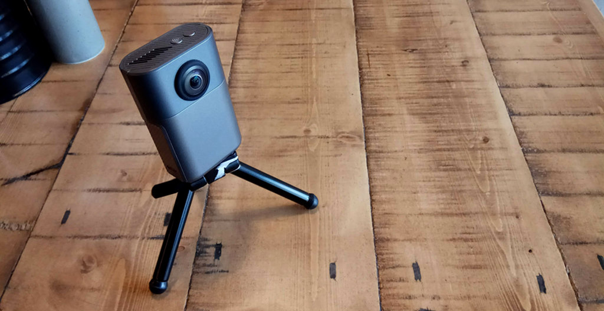

# PyWunderCam

`PyWunderCam` is a Python module that enables control of the Wunder 360 S1 panoramic camera from a Python program.



The camera is based on a Rockchip 1108 System on Chip (SoC) running Linux. 
Within its operating system, it raises three services to serve images and video, control the camera and stream video 
over a WiFi interface. In addition to these services, the camera presents itself as a standard webcam if connected 
via USB. 

At the time of writing, PyWunderCam interfaces with the first two services and enables functionality that is not 
possible via the provided mobile phone application. 

Streaming video and extended functionality are scheduled for upcoming releases.


## Quickstart

```
    from pywundercam import PyWunderCamAuto
    
    camera_control = PyWunderCamAuto()
```    

### Single 360 Shot

```
    single_photo = camera_control.single_shot()
```


### Continuous (Burst) 360 Shot

```
    photos = camera_control.continuous_shot()
```

### Altering the ISO, White Balance and Exposure Compensation Modes

Both of the above functions ( `.single_shot()`, `.continuous_shot()`) take optional parameters 
`iso`, `white_balance_mode` and `exposure_compensation`. For more information on the values of 
camera state parameters, please see `pywundercam.CamState`.

### Storing Images

To store the result of a single shot:

```
    single_photo[0].save_to("MyImage.jpg")
```

To store the result of a continuous (burst) shot:

```
    photos[0].save_to("./")
```    

Worth noting at this point that:

1. In the case of a single image, all that is required is a filename. When saving 
   the result of a continuous (burst) shot, all that is required is a directory 
   in which all files belonging to the same shot will be stored.

2. Depending on file sizes and number of shots (in continuous mode), the file transfers 
   might appear to be inserting a small delay in the whole process.
       
### Displaying images

`pywundercam` makes use of the `pillow` module and returns images that are ready to be forwarded to 
Python's ritch ecosystem of image processing modules. A quick way of displaying the image is to use `matplotlib`.

Continuing from the above example, to display the result of a single shot:

```
    from matplotlib import pyplot as plt
    
    plt.imshow(single_photo[0].get())
    plt.axis("off")
    plt.show()
```
    
And in the case of a continuous (burst) shot, a specific picture out of the set would have to be chosen first:

```
    plt.imshow(photos[0].get())
    plt.axis("off")
    plt.show()
```


This concludes the quickstart guide which makes use of `PyWunderCamAuto`. Although this client allows you to take 
pictures in single and continuous (burst) modes, the real power of `pywundercam` is in the underlying client object 
`PyWunderCam` that allows finer control over the complete parameter set of the Wunder 360 S1.

You can now [browse the rest of the documentation](https://pywundercam.readthedocs.io/en/latest/) to learn more about exceptions, hardware, and the general design of PyWunderCam.
